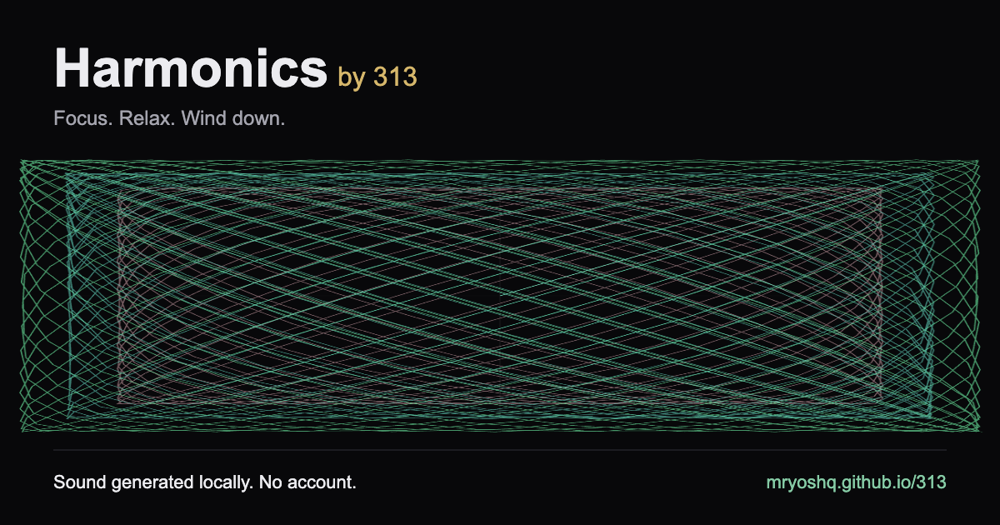

# Harmonics by 313

Binaural tones, background sound generated on the fly, and wave art drawn from the maths behind it. Runs offline, installs like an app, never asks who you are.

**[Open Harmonics →](https://mryoshq.github.io/313/)**



## What it does

- **Sixteen pulse speeds**, from half a beat per second up to forty — sleep at one end, focus at the other.
- **Backgrounds built live**: rain, nature, cafe, outside, or plain noise. No audio files, ever.
- **Wave art** animated from the real interference maths, not decoration.
- **Study and sleep timers** with rounds, breaks, and a fade-out instead of a hard stop.
- **Works offline.** Install it once and it keeps playing with no connection.

## Run it

```sh
python3 -m http.server 4173 --bind 127.0.0.1
```

Open `http://localhost:4173/`. Nothing to install.

Edit `harmonics.html`, then run `node scripts/prepare-site.cjs` to regenerate `index.html`. 

## Publish with GitHub Pages

In the repository's **Settings → Pages → Build and deployment**, select **GitHub Actions** as the source. A private personal repository requires GitHub Pro for Pages; a public repository works with GitHub Free.

Push to `main` to run `.github/workflows/pages.yml`. It prepares `_site`, runs the Node tests, and deploys to https://mryoshq.github.io/313/. You can also run **Deploy to GitHub Pages** manually from the Actions tab.
